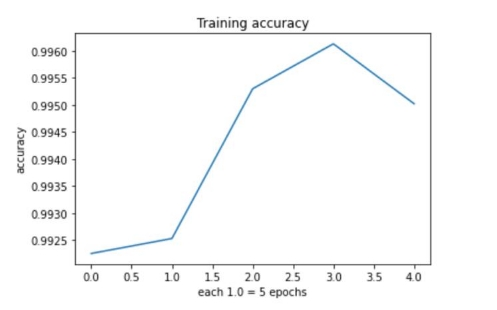
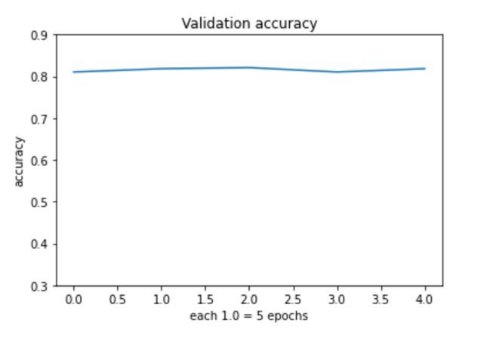
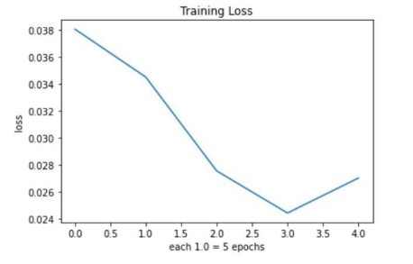
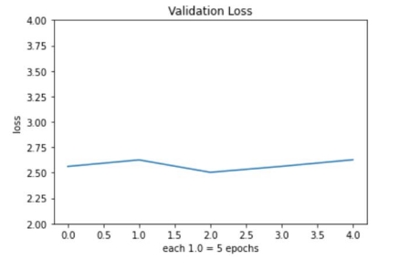

# Project Title --> Created an iPhone application and named it 
as ISTORIA(Greek word meaning history).

## Subject : Advanced Intelligent Systems and Deep Learning – CPS 584 01 Instructor : Mehdi R. Zargham 

## Project by : Karthi Balasundaram, Ashutosh Todwal 

**Abstract**:

Every human comes across multiple statues in their day to day life and most of the histories of well known sculptures are unknown to us. Designing a model to classify the images of those statues to be recognized and reveal history would be a great value addition for tourists, travelers, students, and many more audience. In this work, we aim to develop a system using convolutional neural network(CNN). This CNN model takes the number of images captured in various atmospheric conditions as input and gets trained accordingly with maximum accuracy using tensorflow and keras libraries. We aim to collect 100 to 130 raw images(datasets) of the sculpture(Christ the Teacher) from all possible directions, angles, and occlusion. The statue is located in front of the Fitz Hall within the campus of University of Dayton. The trained model will be then imposed into a handheld device so that any person who captures it in real time will get  to learn its history along with a brief description. The main aim is to design this model which can be used as an established method to provide knowledge of the well known statues which we come across in our life.

**Introduction**: 

Every human comes across multiple statues in their day to day life and most of the histories of well known sculptures are unknown to us. So designed and trained a deep learning model to classify the statues based on their features and revealing description about it in MacBook’s Jupyter notebook. In real life we won’t be having laptops handy at all times therefore developed and deployed the same model compatible with handheld device; iPhone. This application would be a great value addition for tourists, travelers, students and many more audience and works even when no internet connectivity is available to the device. 

**Project Description**: 

In this work, we aim to develop a system using efficientNet\_lite4 [(1)](#_page4_x69.00_y422.00), a simple pre-trained CNN (convolutional neural network) model used for image classification. This model takes the number of images captured in various atmospheric conditions as input and gets trained accordingly with maximum accuracy, this pre-trained model is extremely lightweight and can be easily deployed to the mobile devices[(2)](#_page4_x69.00_y448.00) and that is our ultimate aim too. 

**Purpose of the project**: 

Project’s  main  goal  is  to  develop  a  deep  learning  model  using  pre  trained efficientNet\_lite4 and deploy the same to iPhone so that any person who captures it in real time will get to learn its history along with a brief description. The main aim is to design this model which can be used as an established method to provide knowledge of the well known statues within the University of Dayton. 

**Source of data**: 

Total of 155 raw images(datasets) of the sculpture(Christ the Teacher) was captured from all possible directions, angles, and occlusion with iPhone 12 mini and iPhone 7 plus. The statue is located in front of the Fitz Hall within the campus of University of Dayton. In total we had around 4000 images for training for 24 sculptures out of which few were rejected because of resolution and format issues. Finalized 3615 images for training and 385 images for validation with 24 classes collected from all teams. Total training dataset is about 13.58 gigabytes and validation dataset is 1.47 gigabytes. Sample image of the selected statue is added below for reference, 

 

**Proposed method**: 

Trained the model in jupyter notebook for 20 epochs, each epoch took around 15 minutes with total running time of 5 hours with training accuracy of 99.5%, saved the trained model as \*.tflite file which in turn was converted to \*.onnx file to be deployed into Unity development engine. An ONNX file or open neural network exchange file is 6 to 7 times faster than the original TFLite model and it works very well with larger datasets[(4)](#_page4_x69.00_y475.00) when deployed to an handheld device. 

**Details of implementation**: 

We have followed the below steps for deploying the trained model to iPhone: 

- Using Jupyter notebook trained the model using efficientnet\_lite4 CNN, 
- After training for 20 epochs and with 99.5% training accuracy converted it to \*.tflite model 
- Using Google Colab, converted the \*.tflite file to \*.onnx file by running few pip commands[(3)](#_page4_x69.00_y462.00), 
- Added the ONNX model to Unity development engine along with other assets such as trigger video, classification scripts, labels text file, etc., 
- Then from Unity the iOS build has been extracted to the local system, 
- Then the same has been deployed to iPhone 12 mini running under software version 15.1 using Xcode developer account. 

**Result**: 

Successfully completed deploying the model to iPhone and below are the graphs that demonstrates accuracy and loss functions., 

The training and validation accuracy are plotted with number of epochs in x-axis and accuracy in y-axis, the value of each 1.0 in x-axis corresponds to 5 epochs. 

The maximum training accuracy is 99.6% and it was achieved in the 15th epoch. 

The maximum validation accuracy is 82.34% and it was almost equal in all epochs. 

The training and validation losses are plotted with number of epochs in x-axis and loss in y-axis, the value of each 1.0 in x-axis corresponds to 5 epochs. 

The final training loss is 0.027. 

**Challenges faced**: 

- Usually iPhones with software version 11 and above saves images with extension \*.HEIF (High-efficiency image format), converting those to .jpeg format to normalize all images was quite challenging. 
- The video trigger from Unity engine was projecting smaller in the iPhone’s screen, then had to rebuild and deploy again. 
- The Unity game development engine utilized full RAM and the application got crashed twice. 
- Initially unaware that Xcode developer access needs to be granted to the iPhone under settings for application deployment. 

**Conclusion**: 

Atlast, the iPhone mobile application has been deployed and tested live on the statue ‘Christ the teacher’. Once the iPhone camera detects the accuracy of the statue to be greater than 90%, it triggers a video. Few screenshots are attached below. 

  

**References**: 

1. [https://blog.tensorflow.org/2020/03/higher-accuracy-on-vision-models-with-efficientnet-lite.html ](https://blog.tensorflow.org/2020/03/higher-accuracy-on-vision-models-with-efficientnet-lite.html)
1. [https://arxiv.org/abs/2009.07409 ](https://arxiv.org/abs/2009.07409)
1. [https://github.com/onnx/tensorflow-onnx ](https://github.com/onnx/tensorflow-onnx)
1. [https://pythonsimplified.com/onnx-for-model-interoperability-faster-inference/ ](https://pythonsimplified.com/onnx-for-model-interoperability-faster-inference/)
